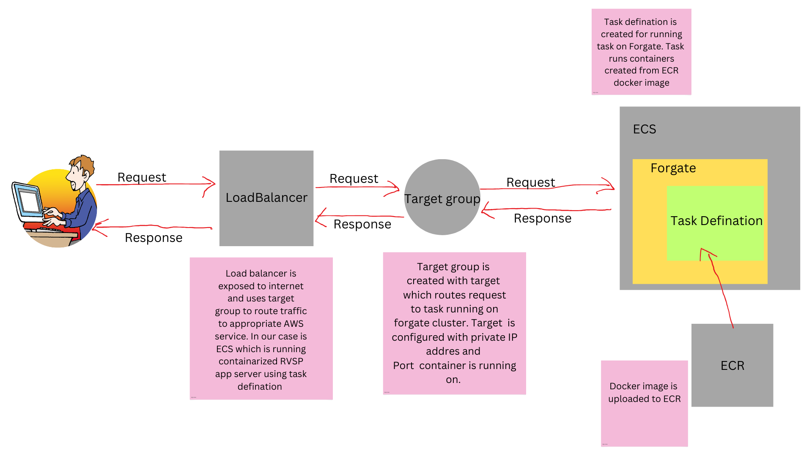

<h1>RSVP Management APIs</h1>

<h3>About</h3>

RSVP managment APIs built using node express. App is deployed in AWS and have basic HTML UI for demonstration purpose. For database  Mongodb Atlas service is used and final application is containarized and deployed on AWS.

<a href="http://rsvp-loadbalancer-1323748626.us-east-1.elb.amazonaws.com/api-docs/" target="_blank">Swagger Specs</a>

<a href="http://rsvp-loadbalancer-1323748626.us-east-1.elb.amazonaws.com/" target="_blank">APIs UI Demonstration </a>

<h3>Tech stack Used</h3>
<ul>
  <li>Javascript</li>
  <li>Node Runtime</li>
  <li>Express framework</li>
  <li>dot env - For managing enviorment variables</li>
  <li>Mongoose - For managing mongodb</li>
  <li>Swagger-ui-express & yamljs - For Swagger specs</li>
  <li>nodemon - For development testing</li>
  <li>Docker - For containirizing </li>
  <li>MongodB Atlas - For Database services</li>
  <li>AWS ECR,ECS(using Fargate),Loadbalancers,Target groups - For Deployment</li>
</ul>

<h3>AWS deployement details</h3>

<h3>Note</h3>

Currently Swagger API docs uses prod server. So data manipulated in swagger UI reflects in realtime. This project is done purly for learning purposes and reference, it is not following industry standard practices.

