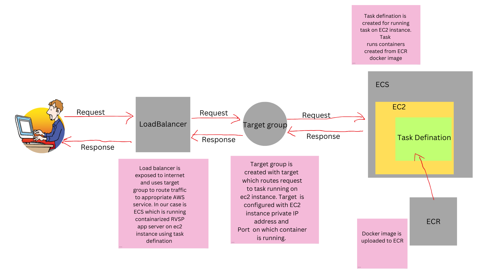

<h1>RSVP Management APIs</h1>

<h3>About</h3>

RSVP management APIs built using node express. Includes basic HTML UI and Swagger Docs for demonstration purposes. For the database  MongoDB Atlas service is used and the final application is containerized and deployed on AWS.

<a href="http://rsvp-loadbalancer-889922805.us-east-1.elb.amazonaws.com/api-docs/" target="_blank">Swagger Specs</a>

<a href="http://rsvp-loadbalancer-889922805.us-east-1.elb.amazonaws.com/" target="_blank">APIs UI Demonstration </a>

<h3>Tech stack Used</h3>
<ul>
  <li>Javascript</li>
  <li>Node Runtime</li>
  <li>Express framework</li>
  <li>dot env - For managing sensitive environment variables</li>
  <li>Mongoose - For managing mongodb</li>
  <li>Swagger-ui-express & yamljs - For Swagger specs</li>
  <li>nodemon - For development testing</li>
  <li>Docker - For containirizing</li>
  <li>MongodB Atlas - For Database services</li>
  <li>AWS ECR,ECS(using EC2),Load balancers,Target groups - For Deployment</li>
</ul>

<h3>AWS deployement details</h3>

<h3>Note</h3>

Currently Swagger API docs use prod server. So data manipulated in swagger UI reflects in real time. This project is done purely for learning purposes and reference.

